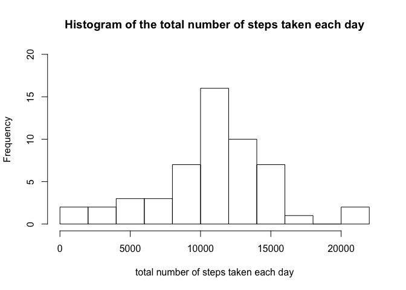
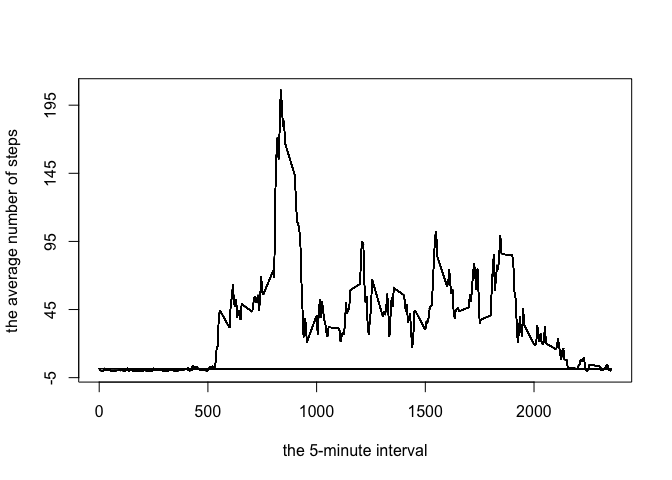
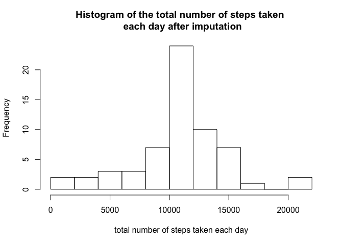
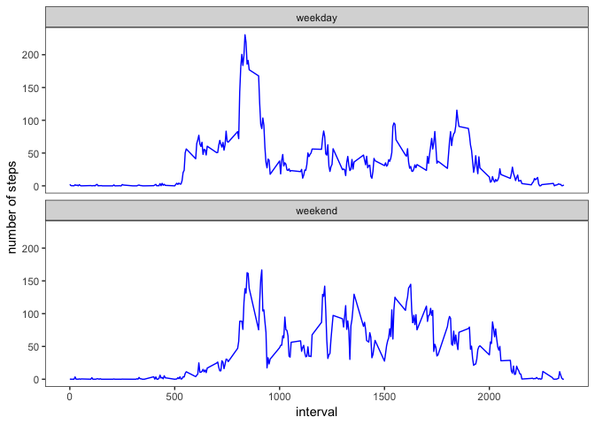

##### load packages 

```r
library(dplyr)
library(ggplot2)
```

## Loading and preprocessing the data

```r
dat<- read.csv('./activity.csv')
```


## What is mean total number of steps taken per day?  

* Histogram of the total number of steps taken each day


```r
total_step<- tapply(dat$steps,dat$date,sum)
hist(total_step,breaks = 12,main='Histogram of the total number of steps taken each day',xlab='total number of steps taken each day',freq=TRUE,ylim=c(0,20))
```

<!-- -->


* Mean and median number of steps taken each day


```r
mean_step<- mean(total_step,na.rm = TRUE)
cat('Mean number of steps taken each day is ',mean_step)
```

```
## Mean number of steps taken each day is  10766.19
```

```r
median_step<-median(total_step,na.rm = TRUE)
cat('\n\n')
```

```r
cat('Median number of steps taken each day is ',median_step)
```

```
## Median number of steps taken each day is  10765
```


## What is the average daily activity pattern?

* Time series plot of the average number of steps taken


```r
dat$avg_step<- tapply(dat$steps,dat$interval,mean, na.rm=TRUE)

plot(dat$interval,dat$avg_step, type='l', yaxt='n', xlab="the 5-minute interval", ylab="the average number of steps")
axis(2,at=seq(-5,245,50))
```

<!-- -->

* The 5-minute interval that, on average, contains the maximum number of steps


```r
max_interval<-dat[which(dat$avg_step==max(dat$avg_step)),'interval']
unique(max_interval)
```

```
## [1] 835
```


## Imputing missing values

* Number of missing values 


```r
misnum<-sum(!complete.cases(dat))
misnum 
```

```
## [1] 2304
```

* Impute missing data with mean steps for that 5-minutes interval 


```r
dat1<- dat
dat1$steps<- ifelse(is.na(dat1$steps), dat1$avg_step, dat1$steps)
```

* Histogram of the total number of steps taken each day after missing values are imputed


```r
total_step1<- tapply(dat1$steps,dat1$date,sum)
hist(total_step1,main='Histogram of the total number of steps taken \n each day after imputation',xlab='total number of steps taken each day',breaks = 12)
```

<!-- -->

```r
mean_step1<- mean(total_step1,na.rm = TRUE)
cat('Mean number of steps taken each day is ',mean_step1)
```

```
## Mean number of steps taken each day is  10766.19
```

```r
median_step1<-median(total_step1,na.rm = TRUE)
cat('\n\n')
```

```r
cat('Median number of steps taken each day is ',median_step1)
```

```
## Median number of steps taken each day is  10766.19
```

Compared with the mean and median number of steps taken each day, there is no difference in mean but a small difference in median. 

## Are there differences in activity patterns between weekdays and weekends?

* Panel plot comparing the average number of steps taken per 5-minute interval across weekdays and weekends


```r
dat1$date1<- as.Date(dat1$date)
dat1$wkfl<- ifelse(weekdays(dat1$date1) %in% c('Saturday','Sunday'),'weekend','weekday')
wdat<- dat1 %>% group_by(wkfl,interval) %>%
       summarise(avg.step=mean(steps,na.rm = TRUE))
       
ggplot(wdat, aes(x=interval,y=avg.step))+
    geom_line(col='blue')+
    facet_wrap(wkfl~., nrow=2)+
    theme_bw()+
    labs(y='number of steps', x='interval')+
    theme(panel.grid.major = element_blank(),
          panel.grid.minor = element_blank())
```

<!-- -->

There are more acitivities in weekdays than weekends. 
